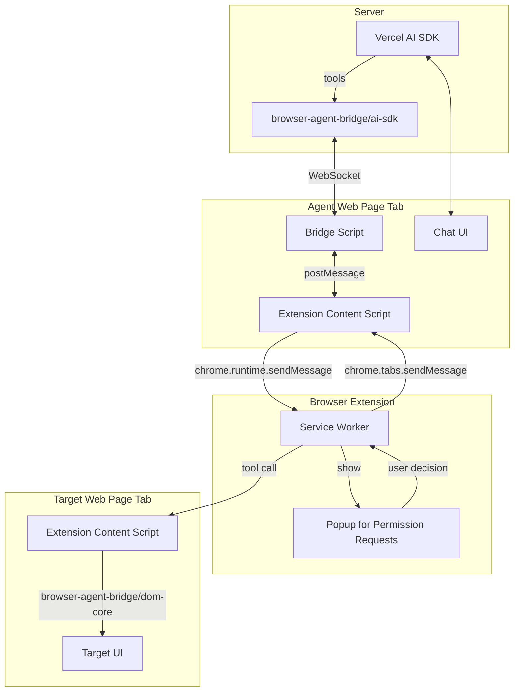

# Browser Agent Bridge

playwright-mcp for AI agent web apps, that only needs a chrome extension to be installed.

## Why this?

The web remains largely inaccessible to AI agents due to authentication barriers (login, 2FA, captcha) and click-based navigation that can't be securely automated with server-side headless browsers.

For agent developers, many web applications also lack sufficient APIs or MCP support. And it's not cost-effective to build dedicated browser automation solutions for each web application by every agent developer.

End users also shouldn't be expected to solve this themselves - non-developers find it difficult to install and run generic automation tools like Playwright MCP or Puppeteer.

Browser Agent Bridge addresses these challenges by:

- Providing users with a secure RPA browser extension that directly integrates with end users' browsers
- Offering developers simple SDKs to integrate AI agents with the extension
- Eliminating the need for complex local installations or per-application browser extensions

## Demo

See [packages/examples/README.md](packages/examples/README.md)

## Architecture Summary

The architecture uses a reversed message flow that provides strong security through browser-validated origins:

```
Node Server ←WebSocket→ Web Page (Tab) ←postMessage→ Browser Extension
```

### Flow

1. **AI agents make tool calls** through `@browser-agent-bridge/ai-sdk`
   - SDK sends commands to Node server via standard HTTP/WebSocket

2. **Developer's server sends commands to web page via WebSocket**
   - The web page connects to its own server (e.g., `wss://app.example.com/ws`)
   - Server pushes automation commands to the web page

3. **Web page forwards commands to browser extension via postMessage**
   - Uses `window.postMessage()` with browser-validated origin
   - Extension receives commands through content script
   - `event.origin` is cryptographically verified by the browser (cannot be forged)

4. **Browser Extension validates and executes**
   - Verifies origin from browser-validated `event.origin`
   - Checks permissions for the requesting origin
   - Shows popup UI for user approval when needed
   - Enforces tab isolation (sessions only access tabs they created)
   - Executes DOM operations using `@browser-agent-bridge/dom-core`

5. **Results flow back through the same chain**
   - Extension → postMessage → Web page → WebSocket → Server → AI agent



### Security Model

- User gives permission per origin
- Origin is validated using postMessage() event.origin
- A session can access tabs which it created only
- These prevents CSRF to other tabs than user allowed ones

See [docs/security-model.md](./docs/security-model.md) for detailed security documentation.
